# ERD

## Visao atual do banco

```mermaid
erDiagram
    USERS {
        uuid id PK
        text email
        text display_name
        text password_hash
        boolean must_change_password
      text employee_code
      text job_title
        text avatar_path
        boolean is_active
        timestamptz created_at
        timestamptz updated_at
    }

    USER_INVITATIONS {
        uuid id PK
        uuid user_id FK
        text email
        uuid invited_by_user_id FK
        text token_hash
        text status
        timestamptz expires_at
        timestamptz accepted_at
        timestamptz revoked_at
        timestamptz created_at
        timestamptz updated_at
    }

    TENANTS {
        uuid id PK
        text slug
        text name
        boolean is_active
        timestamptz created_at
        timestamptz updated_at
    }

    STORES {
        uuid id PK
        uuid tenant_id FK
        text code
        text name
        text city
        boolean is_active
        text default_template_id
        numeric monthly_goal
        numeric weekly_goal
        numeric avg_ticket_goal
        numeric conversion_goal
        numeric pa_goal
        timestamptz created_at
        timestamptz updated_at
    }

    USER_PLATFORM_ROLES {
        uuid user_id PK,FK
        text role
        timestamptz created_at
    }

    USER_TENANT_ROLES {
        uuid id PK
        uuid user_id FK
        uuid tenant_id FK
        text role
        timestamptz created_at
    }

    USER_STORE_ROLES {
        uuid id PK
        uuid user_id FK
        uuid store_id FK
        text role
        timestamptz created_at
    }

    ACCESS_PERMISSIONS {
      text key PK
      text scope
      text description
      timestamptz created_at
    }

    ACCESS_ROLE_PERMISSIONS {
      text role PK
      text permission_key PK,FK
      timestamptz created_at
    }

    USER_ACCESS_OVERRIDES {
      uuid id PK
      uuid user_id FK
      text permission_key FK
      text effect
      uuid tenant_id FK
      uuid store_id FK
      uuid created_by_user_id FK
      text note
      boolean is_active
      timestamptz created_at
      timestamptz updated_at
    }

    STORE_TERMINALS {
      uuid id PK
      uuid tenant_id FK
      uuid store_id FK
      uuid user_id FK
      text code
      text device_label
      text device_slug
      text access_mode
      boolean is_active
      timestamptz last_seen_at
      timestamptz created_at
      timestamptz updated_at
    }

    CONSULTANTS {
        uuid id PK
        uuid tenant_id FK
        uuid store_id FK
        uuid user_id FK
        text name
        text role_label
        text initials
        text color
        numeric monthly_goal
        numeric commission_rate
        numeric conversion_goal
        numeric avg_ticket_goal
        numeric pa_goal
        boolean is_active
        timestamptz created_at
        timestamptz updated_at
    }

    STORE_OPERATION_SETTINGS {
        uuid store_id PK,FK
        text selected_operation_template_id
        integer max_concurrent_services
        integer timing_fast_close_minutes
        integer timing_long_service_minutes
        numeric timing_low_sale_amount
        boolean test_mode_enabled
        boolean auto_fill_finish_modal
        numeric alert_min_conversion_rate
        numeric alert_max_queue_jump_rate
        numeric alert_min_pa_score
        numeric alert_min_ticket_average
        text title
        text product_seen_label
        text product_seen_placeholder
        text product_closed_label
        text product_closed_placeholder
        text notes_label
        text notes_placeholder
        text queue_jump_reason_label
        text queue_jump_reason_placeholder
        text loss_reason_label
        text loss_reason_placeholder
        text customer_section_label
        boolean show_customer_name_field
        boolean show_customer_phone_field
        boolean show_email_field
        boolean show_profession_field
        boolean show_notes_field
        boolean show_product_seen_field
        boolean show_product_closed_field
        boolean show_visit_reason_field
        boolean show_customer_source_field
        boolean show_queue_jump_reason_field
        boolean show_loss_reason_field
        text visit_reason_selection_mode
        text visit_reason_detail_mode
        text loss_reason_selection_mode
        text loss_reason_detail_mode
        text customer_source_selection_mode
        text customer_source_detail_mode
        boolean require_customer_name_field
        boolean require_customer_phone_field
        boolean require_email_field
        boolean require_profession_field
        boolean require_notes_field
        boolean require_product
        boolean require_product_seen_field
        boolean require_product_closed_field
        boolean require_visit_reason
        boolean require_customer_source
        boolean require_customer_name_phone
        boolean require_queue_jump_reason_field
        boolean require_loss_reason_field
        timestamptz created_at
        timestamptz updated_at
    }

    STORE_SETTING_OPTIONS {
        uuid store_id PK,FK
        text kind PK
        text option_id PK
        text label
        integer sort_order
        timestamptz created_at
        timestamptz updated_at
    }

    STORE_CATALOG_PRODUCTS {
        uuid store_id PK,FK
        text product_id PK
        text name
        text code
        text category
        numeric base_price
        integer sort_order
        timestamptz created_at
        timestamptz updated_at
    }

    OPERATION_QUEUE_ENTRIES {
        uuid store_id PK,FK
        uuid consultant_id PK,FK
        integer sort_order
        bigint queue_joined_at
        timestamptz created_at
    }

    OPERATION_ACTIVE_SERVICES {
        uuid store_id PK,FK
        uuid consultant_id PK,FK
        text service_id
        bigint service_started_at
        bigint queue_joined_at
        bigint queue_wait_ms
        integer queue_position_at_start
        text start_mode
        jsonb skipped_people_json
        timestamptz created_at
        timestamptz updated_at
    }

    OPERATION_PAUSED_CONSULTANTS {
        uuid store_id PK,FK
        uuid consultant_id PK,FK
        text reason
        text kind
        bigint started_at
        timestamptz created_at
        timestamptz updated_at
    }

    OPERATION_CURRENT_STATUS {
        uuid store_id PK,FK
        uuid consultant_id PK,FK
        text status
        bigint started_at
        timestamptz created_at
        timestamptz updated_at
    }

    OPERATION_STATUS_SESSIONS {
        uuid id PK
        uuid store_id FK
        uuid consultant_id FK
        text status
        bigint started_at
        bigint ended_at
        bigint duration_ms
        timestamptz created_at
    }

    OPERATION_SERVICE_HISTORY {
        uuid id PK
        uuid store_id FK
        text service_id
        uuid person_id FK
        text person_name
        bigint started_at
        bigint finished_at
        bigint duration_ms
        text finish_outcome
        text start_mode
        integer queue_position_at_start
        bigint queue_wait_ms
        jsonb skipped_people_json
        integer skipped_count
        boolean is_window_service
        boolean is_gift
        text product_seen
        text product_closed
        text product_details
        jsonb products_seen_json
        jsonb products_closed_json
        boolean products_seen_none
        boolean visit_reasons_not_informed
        boolean customer_sources_not_informed
        text customer_name
        text customer_phone
        text customer_email
        boolean is_existing_customer
        jsonb visit_reasons_json
        jsonb visit_reason_details_json
        jsonb customer_sources_json
        jsonb customer_source_details_json
        jsonb loss_reasons_json
        jsonb loss_reason_details_json
        text loss_reason_id
        text loss_reason
        numeric sale_amount
        text customer_profession
        text queue_jump_reason
        text notes
        jsonb campaign_matches_json
        numeric campaign_bonus_total
        timestamptz created_at
    }

    USER_FEEDBACK {
        uuid id PK
        uuid tenant_id FK
        uuid store_id FK
        uuid user_id FK
        text user_name
        text kind
        text status
        text subject
        text body
        text admin_note
        timestamptz user_last_read_at
        timestamptz created_at
        timestamptz updated_at
    }

      FEEDBACK_READ_STATES {
        uuid feedback_id PK, FK
        uuid user_id PK, FK
        timestamptz last_read_at
        timestamptz created_at
        timestamptz updated_at
      }

      ERP_SYNC_RUNS {
        uuid id PK
        uuid tenant_id FK
        uuid store_id FK
        text store_code
        text store_cnpj
        text data_type
        text mode
        text source_path
        text status
        integer files_seen
        integer files_imported
        integer files_skipped
        integer rows_read
        integer raw_rows_imported
        text error_message
        timestamptz started_at
        timestamptz finished_at
        timestamptz created_at
        timestamptz updated_at
      }

      ERP_SYNC_FILES {
        uuid id PK
        uuid run_id FK
        uuid tenant_id FK
        uuid store_id FK
        text store_code
        text store_cnpj
        text data_type
        text source_name
        text source_path
        text source_kind
        date source_batch_date
        text checksum_sha256
        integer record_count
        text status
        timestamptz imported_at
        timestamptz created_at
        timestamptz updated_at
      }

      ERP_ITEM_RAW {
        uuid id PK
        uuid run_id FK
        uuid file_id FK
        uuid tenant_id FK
        uuid store_id FK
        text store_code
        text store_cnpj
        text source_file_name
        date source_batch_date
        integer source_line_number
        text sku
        text name
        text description
        text supplierreference
        text brandname
        text seasonname
        text category1
        text category2
        text category3
        text size
        text color
        text unit
        text price_raw
        bigint price_cents
        text identifier
        text created_at_raw
        text updated_at_raw
        timestamptz created_at
        timestamptz updated_at
        timestamptz created_at_imported
      }

      ERP_CUSTOMER_RAW {
        uuid id PK
        uuid run_id FK
        uuid file_id FK
        uuid tenant_id FK
        uuid store_id FK
        text source_file_name
        integer source_line_number
        text cpf
        text identifier
        text name
        text email
        text tags
        timestamptz created_at_imported
      }

      ERP_EMPLOYEE_RAW {
        uuid id PK
        uuid run_id FK
        uuid file_id FK
        uuid tenant_id FK
        uuid store_id FK
        text source_file_name
        integer source_line_number
        text original_id
        text name
        text is_active_raw
        timestamptz created_at_imported
      }

      ERP_ORDER_RAW {
        uuid id PK
        uuid run_id FK
        uuid file_id FK
        uuid tenant_id FK
        uuid store_id FK
        text source_file_name
        integer source_line_number
        text order_id
        text sku
        bigint amount_cents
        bigint total_amount_cents
        timestamptz order_date
        timestamptz created_at_imported
      }

      ERP_ORDER_CANCELED_RAW {
        uuid id PK
        uuid run_id FK
        uuid file_id FK
        uuid tenant_id FK
        uuid store_id FK
        text source_file_name
        integer source_line_number
        text order_id
        text sku
        bigint amount_cents
        bigint total_amount_cents
        timestamptz order_date
        timestamptz created_at_imported
      }

      ERP_ITEM_CURRENT {
        uuid tenant_id PK,FK
        uuid store_id PK,FK
        text sku PK
        text identifier
        text name
        text description
        text supplierreference
        text brandname
        text seasonname
        text category1
        text category2
        text category3
        text size
        text color
        text unit
        text price_raw
        bigint price_cents
        text source_file_name
        date source_batch_date
        integer source_line_number
        timestamptz source_created_at
        timestamptz source_updated_at
        uuid run_id FK
        uuid file_id FK
        timestamptz created_at
        timestamptz updated_at
      }

    TENANTS ||--o{ STORES : owns
    USERS ||--o| USER_PLATFORM_ROLES : has
    USERS ||--o{ USER_TENANT_ROLES : has
    USERS ||--o{ USER_STORE_ROLES : has
    USERS ||--o{ USER_INVITATIONS : onboarding
    USERS ||--o{ USER_ACCESS_OVERRIDES : overrides
    TENANTS ||--o{ USER_TENANT_ROLES : scopes
    STORES ||--o{ USER_STORE_ROLES : scopes
    TENANTS ||--o{ STORE_TERMINALS : owns
    STORES ||--|| STORE_TERMINALS : device_access
    USERS ||--|| STORE_TERMINALS : terminal_login
    ACCESS_PERMISSIONS ||--o{ ACCESS_ROLE_PERMISSIONS : granted_to_role
    ACCESS_PERMISSIONS ||--o{ USER_ACCESS_OVERRIDES : overridden
    TENANTS ||--o{ CONSULTANTS : scopes
    STORES ||--o{ CONSULTANTS : roster
    STORES ||--|| STORE_OPERATION_SETTINGS : config
    STORES ||--o{ STORE_SETTING_OPTIONS : catalogs
    STORES ||--o{ STORE_CATALOG_PRODUCTS : catalog
    STORES ||--o{ OPERATION_QUEUE_ENTRIES : queue
    STORES ||--o{ OPERATION_ACTIVE_SERVICES : active_services
    STORES ||--o{ OPERATION_PAUSED_CONSULTANTS : paused
    STORES ||--o{ OPERATION_CURRENT_STATUS : current_status
    STORES ||--o{ OPERATION_STATUS_SESSIONS : status_history
    STORES ||--o{ OPERATION_SERVICE_HISTORY : service_history
    CONSULTANTS ||--o{ OPERATION_QUEUE_ENTRIES : queue_member
    CONSULTANTS ||--o{ OPERATION_ACTIVE_SERVICES : serves
    CONSULTANTS ||--o{ OPERATION_PAUSED_CONSULTANTS : pauses
    CONSULTANTS ||--o{ OPERATION_CURRENT_STATUS : current_status
    CONSULTANTS ||--o{ OPERATION_STATUS_SESSIONS : status_sessions
    CONSULTANTS ||--o{ OPERATION_SERVICE_HISTORY : closes
    TENANTS ||--o{ USER_FEEDBACK : receives
    STORES ||--o{ USER_FEEDBACK : scopes
    USERS ||--o{ USER_FEEDBACK : submits
    TENANTS ||--o{ ERP_SYNC_RUNS : erp_scope
    STORES ||--o{ ERP_SYNC_RUNS : erp_scope
    ERP_SYNC_RUNS ||--o{ ERP_SYNC_FILES : batches
    TENANTS ||--o{ ERP_SYNC_FILES : erp_scope
    STORES ||--o{ ERP_SYNC_FILES : erp_scope
    ERP_SYNC_FILES ||--o{ ERP_ITEM_RAW : imports
    ERP_SYNC_FILES ||--o{ ERP_CUSTOMER_RAW : imports
    ERP_SYNC_FILES ||--o{ ERP_EMPLOYEE_RAW : imports
    ERP_SYNC_FILES ||--o{ ERP_ORDER_RAW : imports
    ERP_SYNC_FILES ||--o{ ERP_ORDER_CANCELED_RAW : imports
    TENANTS ||--o{ ERP_ITEM_CURRENT : erp_catalog
    STORES ||--o{ ERP_ITEM_CURRENT : erp_catalog
```

## Leitura rapida

- `users`
  - identidade base da pessoa autenticada
  - `password_hash` pode nascer nulo durante onboarding por convite
  - `employee_code` guarda matricula quando houver
  - `job_title` guarda o cargo exibivel do acesso
  - `avatar_path` guarda apenas o caminho publico da foto; o arquivo vive no volume do backend
- `user_invitations`
- `users.must_change_password`
  - trilha de convite/onboarding e aceite inicial de senha
- `tenants`
  - cliente/dono do grupo
- `stores`
  - lojas pertencentes a um tenant, incluindo template padrao e metas administrativas
- `user_platform_roles`
  - acesso interno de plataforma, hoje para `platform_admin`
- `user_tenant_roles`
  - papeis no escopo do tenant, hoje `marketing`, `director` e `owner`
- `user_store_roles`
  - papeis no escopo da loja, hoje `consultant`, `manager` e `store_terminal`
- `access_permissions`
  - catalogo central de capacidades por escopo
- `access_role_permissions`
  - grants default por papel para preparar visibilidade configuravel no produto
- `user_access_overrides`
  - excecoes allow/deny por usuario em nivel de tenant ou loja
- `store_terminals`
  - identidade fixa dos computadores das lojas, 1:1 com store e login tecnico read-only
- `consultants`
  - roster administrativo por loja para a operacao
  - no seed MVP cada consultor ja nasce com vinculo 1:1 em `users`
- `tenant_operation_settings`
  - fonte de verdade tenant-wide para configuracao operacional
  - inclui limites como `max_concurrent_services` e `max_concurrent_services_per_consultant`
- `tenant_setting_options`
  - catalogos configuraveis tenant-wide para motivos, origens, pausas e correlatos
- `tenant_catalog_products`
  - catalogo de produtos tenant-wide consumido pelo modal e pela operacao
- `store_operation_settings`
  - legado de transicao por loja; deve ser tratado como fallback/backfill, nao como fonte principal de escrita
- `store_setting_options`
  - legado de transicao por loja, tipados por `kind`
  - `kind` atual: `visit_reason`, `customer_source`, `pause_reason`, `queue_jump_reason`, `loss_reason`, `profession`
- `store_catalog_products`
  - legado de transicao por loja para catalogo de produtos
- `operation_queue_entries`
  - fila corrente por loja
- `erp_sync_runs`
  - trilha de execucao por tenant/loja/tipo para bootstrap, sync incremental e futuras exportacoes
- `erp_sync_files`
  - metadados por lote/arquivo com checksum, status e deduplicacao idempotente
- `erp_*_raw`
  - espelho raw do layout FTP por tipo, com metadados de lote e linha de origem
- `erp_item_current`
  - projecao rapida e deduplicada por `tenant_id + store_id + sku`, fonte de busca do MVP de produtos
- `operation_active_services`
  - atendimentos em andamento
- `operation_paused_consultants`
  - pausas correntes por consultor
- `operation_current_status`
  - status atual resumido por consultor
- `operation_status_sessions`
  - trilha append-only das transicoes de status
- `operation_service_history`
  - historico append-only do fechamento operacional

## Seeds atuais

A migration de seed cria:

- `tenant-demo`
- 4 lojas operacionais (`Riomar`, `Jardins`, `Garcia`, `Treze`)
- 29 acessos reais de MVP entre consultores, gerentes, marketing, diretoria, terminais e dev
- memberships coerentes com os papeis atuais do auth
- terminais fixos por loja com login tecnico dedicado

## Observacoes de modelagem

- `settings` deixou de viver em um JSON gigante e foi normalizado por tabela
- a fonte de verdade atual de configuracao e catalogos fica nas tabelas `tenant_*`; as tabelas `store_*` seguem apenas para compatibilidade e backfill controlado
- `operations` usa tabelas correntes para snapshot rapido e tabelas append-only para historico
- `reports` le o historico principalmente por `store_id` + `finished_at`, com indices dedicados para tempo, consultor e desfecho
- `user_invitations` guarda o token em hash, nunca o token aberto
- onboarding inicial funciona assim:
  - admin cria usuario sem senha
  - backend gera convite com expiracao
  - usuario aceita o convite e define a primeira senha
- a base agora tambem possui catalogo de permissoes e overrides por usuario para permitir evolucao de visibilidade dentro da plataforma sem redesenhar auth
- alguns campos do historico continuam em `jsonb` por serem listas e mapas variaveis do fechamento, como:
  - `products_seen_json`
  - `products_closed_json`
  - `visit_reasons_json`
  - `visit_reason_details_json`
  - `customer_sources_json`
  - `customer_source_details_json`
  - `loss_reasons_json`
  - `loss_reason_details_json`
- para agregacao e filtros, o dado estruturado em `jsonb` deve ser tratado como fonte de verdade antes dos campos escalares legados
  - `campaign_matches_json`

## Proxima camada que deve entrar aqui

- websocket/outbox de eventos por loja
- campanhas server-side
- relatorios e analytics server-side
- endurecimento do modelo de identidade operacional:
  - consultor como conta real obrigatoria
  - terminal de loja como conta fixa com operacao completa da propria unidade
  - futuras amarras de dispositivo/origem por loja
  - editor de grants/overrides aproveitando `access_permissions` e `user_access_overrides`
